<p align="center">
  
</p>

# HRIA — HR Intelligence & Bias Analysis

HRIA es un proyecto de análisis exploratorio de datos (EDA) desarrollado para **DataTalent Solutions**. Su objetivo es diseñar programas de reskilling basados en evidencia y orientar a candidatos hacia las oportunidades más reales del mercado laboral de datos.

Analizamos **19.725 ofertas de empleo** del mercado de datos y tecnología, complementadas con fuentes del mercado español, para responder preguntas estratégicas: qué roles priorizar, qué habilidades enseñar, qué salario esperar y cuál es el retorno de invertir en formación.

---

## 🎬 Demo

[](https://youtu.be/570OBE56TkA?si=0yoKYaZ46YlkC2RI)

Aplicación interactiva: [github.com/adryeli/hria_streamlit](https://github.com/adryeli/hria_streamlit)

---

## Índice

- [Resumen Ejecutivo](#resumen-ejecutivo)
- [Problema de Negocio](#problema-de-negocio)
- [Dataset Utilizado](#dataset-utilizado)
- [Estructura del Proyecto](#estructura-del-proyecto)
- [Metodología](#metodología)
- [💡 Hallazgos Clave](#hallazgos-clave)
- [⚠️ Sesgos y Limitaciones](#sesgos-y-limitaciones)
- [🎯 Recomendaciones Estratégicas](#recomendaciones-estratégicas)
- [🛠️ Instalación](#instalación)
- [👥 Equipo](#equipo)

---

## Resumen Ejecutivo

HRIA (HR Intelligence & Bias Analysis) es un proyecto de análisis exploratorio de datos desarrollado para DataTalent Solutions con el objetivo de diseñar programas de reskilling basados en evidencia y orientar a candidatos hacia las oportunidades más reales del mercado laboral de datos.

A partir del análisis de **19.725 ofertas de empleo** y fuentes complementarias del mercado español, identificamos qué perfiles ofrecen mayor probabilidad de inserción laboral, qué habilidades son más demandadas, qué sectores generan más oportunidades y cuál es el retorno económico potencial de una transición profesional hacia los roles de datos.

### Hallazgos principales

* El **66% de las ofertas** corresponden a perfiles Mid-Senior.
* **Data Analyst** es la puerta de entrada más accesible para perfiles junior.
* El salto salarial de **Entry Level a Mid-Senior supera el 35%**.
* El mercado español prioriza habilidades como **Cloud Computing, Java, Python, Azure, Git y AWS**.
* El retorno económico estimado permite amortizar un programa de reskilling en menos de un año.

---

## Problema de Negocio

DataTalent Solutions necesitaba responder una pregunta estratégica:

> ¿Cómo diseñar un programa de reskilling alineado con la demanda real del mercado laboral y maximizar las oportunidades de colocación de sus alumnos?

Para ello era necesario comprender:

* Qué roles presentan mayor accesibilidad para nuevos profesionales.
* Qué habilidades técnicas demanda el mercado.
* Qué sectores concentran las oportunidades laborales.
* Qué retorno económico puede esperar un alumno.
* Qué limitaciones presentan los datos utilizados para tomar decisiones.

---

## Dataset Utilizado

<details>
<summary>Ver fuentes y periodo analizado</summary>

### Dataset principal

* LinkedIn Job Postings Dataset (Kaggle)
* 19.725 ofertas analizadas
* Roles relacionados con datos y tecnología
* Información sobre:

  * Salarios
  * Seniority
  * Industrias
  * Skills
  * Aplicaciones y visualizaciones

### Fuentes complementarias

Para validar los resultados en el contexto español se incorporaron:

* Fundación Telefónica / OrientaHub (Infojobs, Tecnoempleo, etc)

### Periodo analizado

* LinkedIn Jobs 2024
* Mercado español: diciembre 2025 – abril 2026

</details>

---

## Estructura del Proyecto

<details>
<summary>Ver estructura de carpetas y archivos</summary>

```
HRIA/
├── notebooks/
│   ├── Phase1_Initial_Exploration.ipynb
│   ├── Phase2_Data_Cleaning_Preparation.ipynb
│   ├── Phase3_Statistical_Bias_Analysis.ipynb
│   ├── Phase3_1_Bias_Report.ipynb
│   └── Phase4_Visualization.ipynb
├── charts/
│   ├── viz1.1_distribucion_salario.png
│   ├── viz1.2_qq_plots_escala_real.png
│   ├── viz2_boxplot_experiencia.png
│   ├── viz3_business_units_global_vs_spain.png
│   ├── viz4.1_hard_skills_global_vs_spain.png
│   ├── viz4.2_most_demanded_skills_per_role.png
│   ├── viz5_top_industrias.png
│   ├── viz6_scatter_vistas_solicitudes.png
│   ├── viz7_heatmap_correlaciones.png
│   ├── viz8_tipo_contrato.png
│   ├── viz9_salario_por_experiencia.png
│   ├── viz10_salario_por_rol.png
│   ├── viz11_accesibilidad_vs_salario.png
│   ├── viz12_roi_reskilling.png
│   └── viz_intro_sesgo.png
├── docs/
│   └── assets/
│       ├── logos/
│       │   └── logo_hria.png
│       └── skills_logos/
├── requirements.txt
└── README.md
```

</details>

---

## Metodología

<details>
<summary>Ver fases del análisis</summary>

### 1. Exploración

* Inspección de variables
* Identificación de tipos de datos
* Análisis descriptivo
* Evaluación de valores nulos

### 2. Limpieza

* Tratamiento de registros incompletos
* Normalización de categorías
* Validación de consistencia
* Revisión de outliers

### 3. Análisis

* Estadística descriptiva
* Comparaciones entre grupos
* Análisis salarial
* Análisis de skills
* Segmentación por industria
* Evaluación de competitividad

### 4. Sesgos

* Identificación de sesgos de selección
* Evaluación de datos faltantes
* Limitaciones geográficas
* Riesgos para la toma de decisiones

</details>

---

## Hallazgos Clave

### ¿Qué rol priorizar?

<p align="center">
  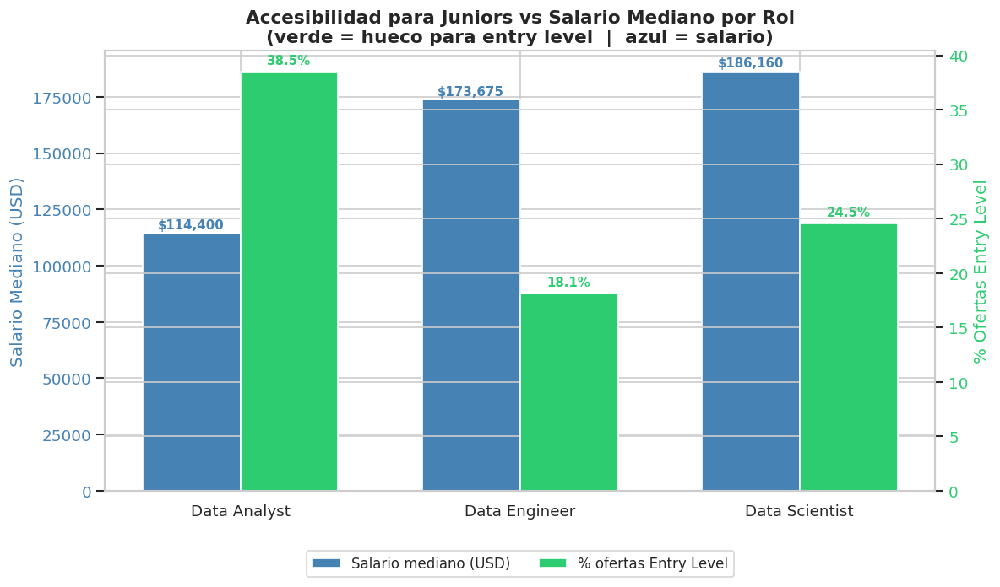
</p>

<p align="center">
  <em>Accesibilidad de los principales roles de datos para perfiles junior.</em>
</p>

<p align="center">
  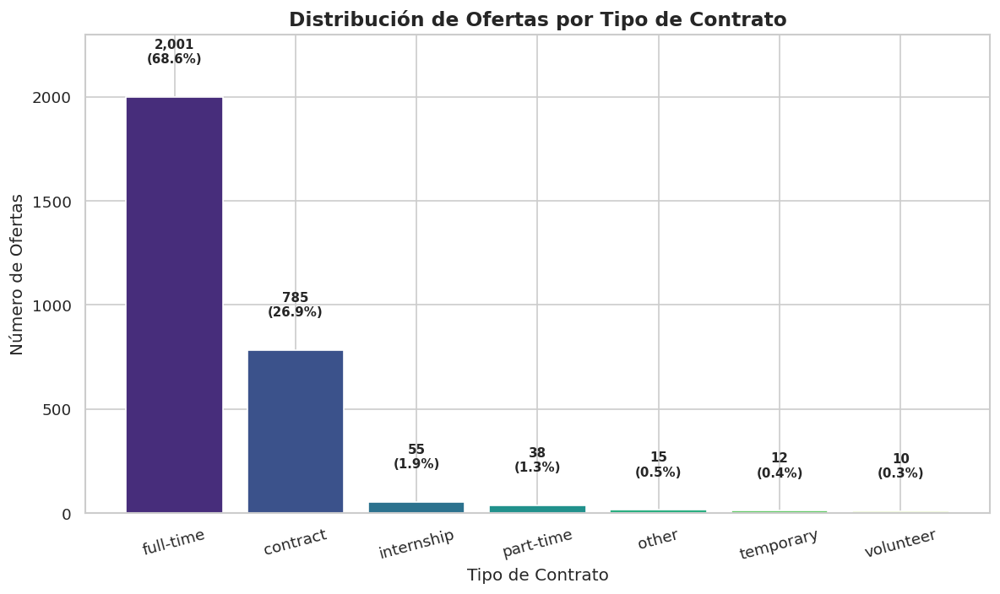
</p>

<p align="center">
  <em>Distribución por tipo de contrato en ofertas de datos.</em>
</p>

**Data Analyst es la mejor puerta de entrada.** El 38,5% de las ofertas para Data Analyst son accesibles para perfiles junior, frente al 22% para Data Scientist y el 18% para Data Engineer.

La primera colocación es significativamente más probable comenzando por Data Analyst, con una combinación equilibrada de accesibilidad y salario competitivo. Diseñar el itinerario inicial orientado a este rol maximiza la empleabilidad desde el primer mes de búsqueda.

---

### ¿Qué salario esperar?

<p align="center">
  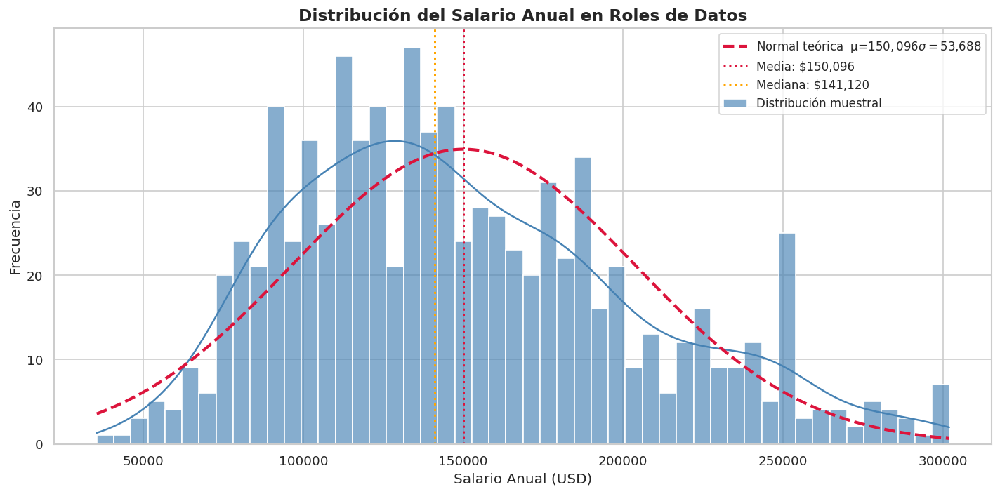
</p>

<p align="center">
  <em>Distribución general de salarios en el mercado de datos.</em>
</p>

<p align="center">
  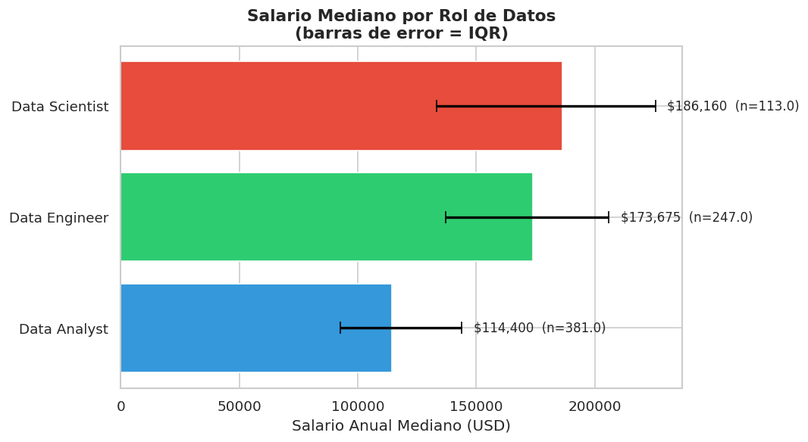
</p>

<p align="center">
  <em>Comparativa salarial entre Data Analyst, Data Engineer y Data Scientist.</em>
</p>

<p align="center">
  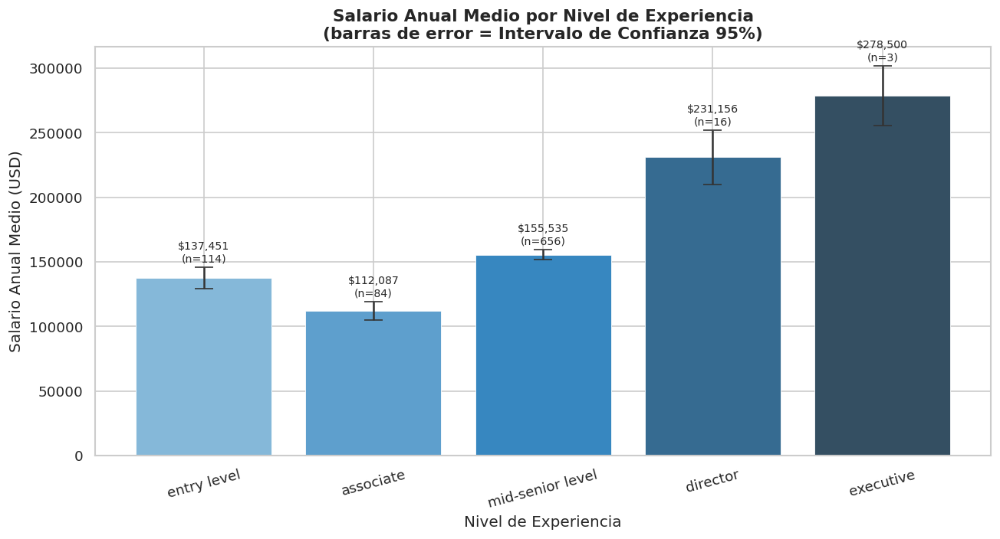
</p>

<p align="center">
  <em>Progresión salarial según nivel de experiencia.</em>
</p>

<p align="center">
  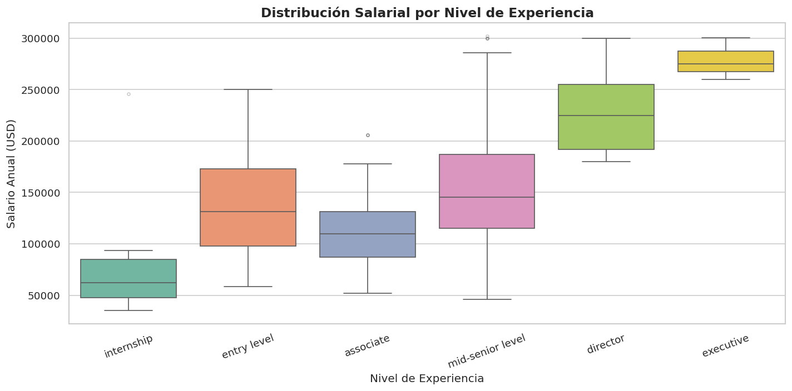
</p>

<p align="center">
  <em>Boxplot de salarios por nivel de experiencia.</em>
</p>

<p align="center">
  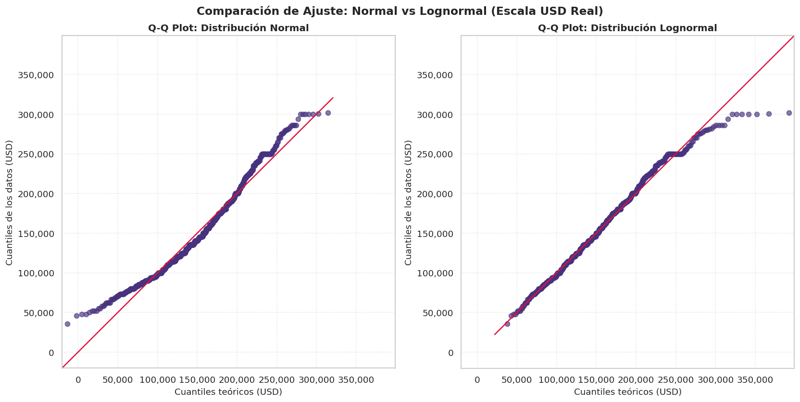
</p>

<p align="center">
  <em>Q-Q plots: comparativa distribución Normal vs Lognormal de salarios.</em>
</p>

**El mayor salto salarial ocurre entre Entry Level y Mid-Senior.** El incremento estimado supera los 35.000 dólares anuales, lo que convierte el reskilling en una inversión con retorno cuantificable a corto plazo.

---

### ¿Qué skills enseñar?

<p align="center">
  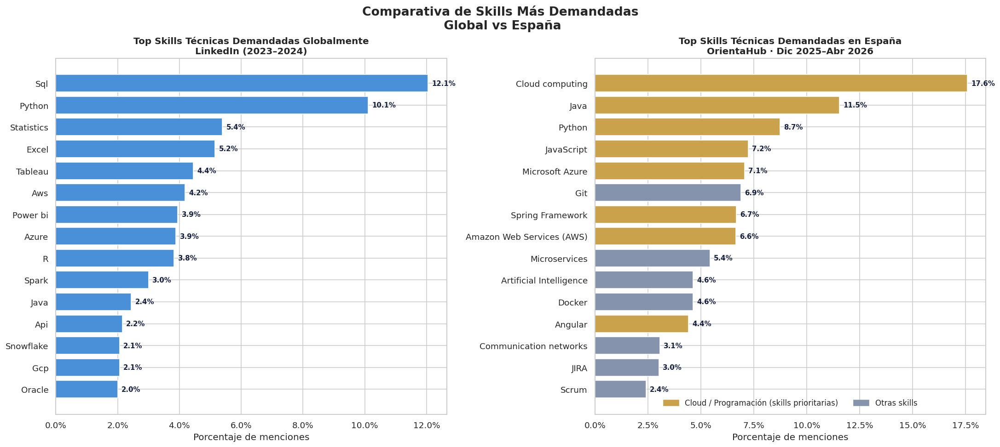
</p>

<p align="center">
  <em>Top hard skills demandadas: mercado global vs. España.</em>
</p>

<p align="center">
  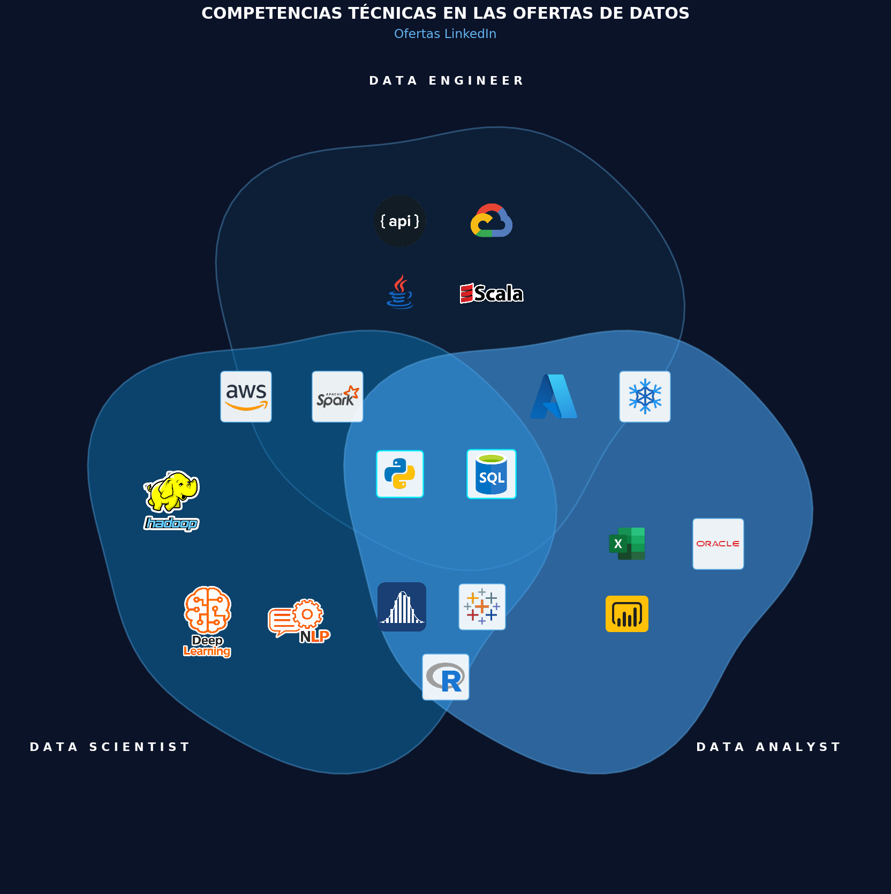
</p>

<p align="center">
  <em>Habilidades más demandadas por rol: Data Analyst, Data Engineer y Data Scientist.</em>
</p>

<p align="center">
  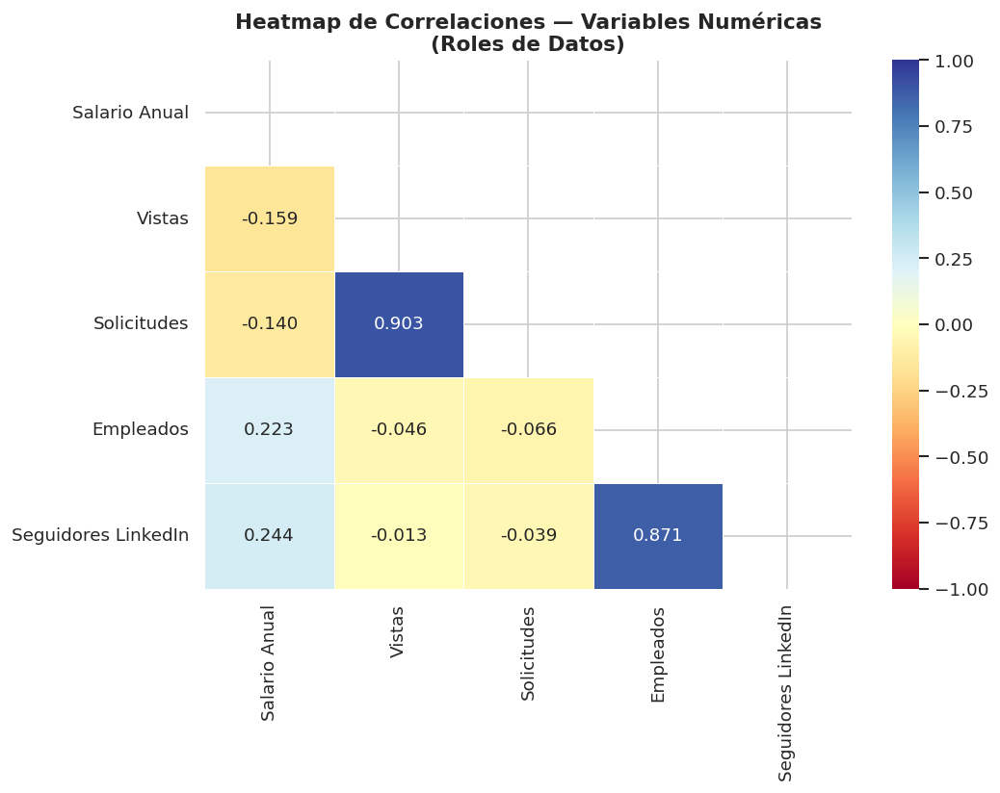
</p>

<p align="center">
  <em>Heatmap de correlaciones entre variables del dataset.</em>
</p>

**El mercado español prioriza habilidades concretas.** Top tecnologías identificadas:

1. Cloud Computing
2. Java
3. Python
4. JavaScript
5. Microsoft Azure
6. Git
7. AWS
8. Microservices
9. Docker
10. Artificial Intelligence

Las empresas demandan perfiles capaces de combinar programación, cloud y buenas prácticas de desarrollo. El currículo debe construirse sobre Python, Git, Azure/AWS y metodologías de trabajo en equipo.

---

### ¿Qué industrias concentran las oportunidades?

<p align="center">
  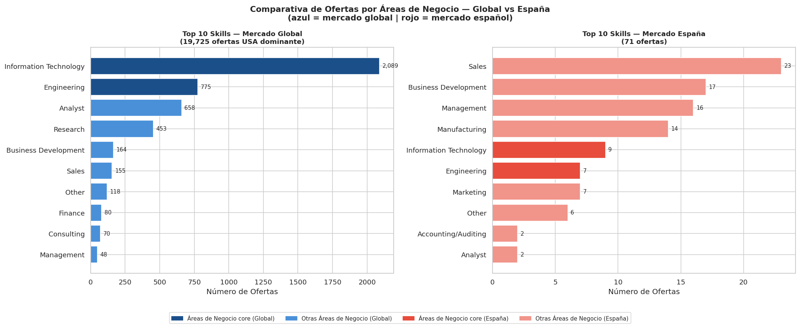
</p>

<p align="center">
  <em>Distribución de unidades de negocio: mercado global vs. España.</em>
</p>

<p align="center">
  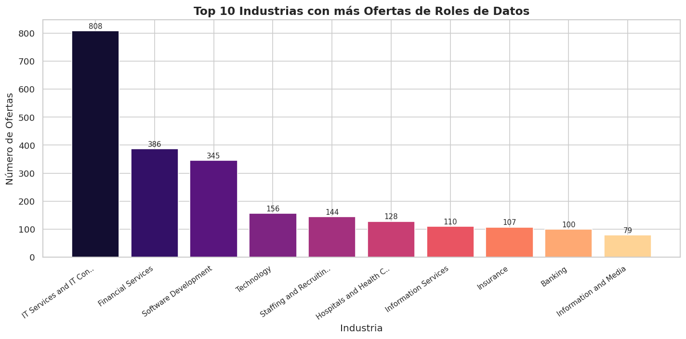
</p>

<p align="center">
  <em>Top industrias por volumen de ofertas de empleo en datos.</em>
</p>

Aunque IT Services lidera el volumen de contratación, existen oportunidades relevantes en:

* Healthcare
* Finance
* Manufacturing
* Defense

La especialización sectorial puede convertirse en una ventaja competitiva frente a otros candidatos con perfil exclusivamente técnico.

---

### Competencia del mercado

<p align="center">
  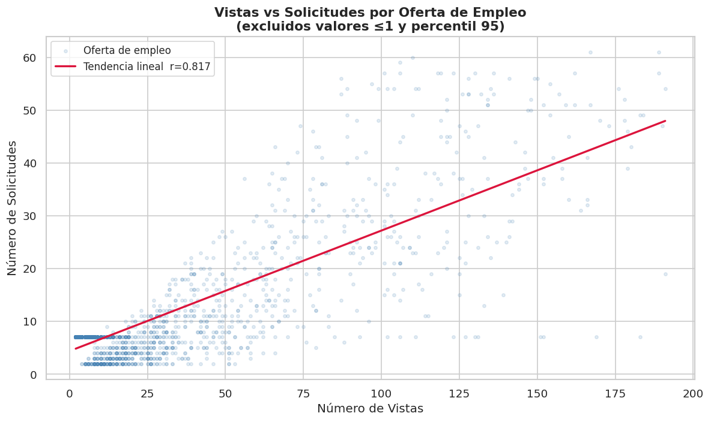
</p>

<p align="center">
  <em>Relación entre visualizaciones y solicitudes en ofertas de empleo de datos.</em>
</p>

Solo el 39% de las ofertas muestran solicitudes reales. Sin embargo, la correlación entre vistas y solicitudes alcanza **r = 0,72**, lo que permite usar las visualizaciones como indicador universal de la competitividad de una oferta incluso cuando faltan datos de aplicaciones.

---

### ROI del Reskilling

<p align="center">
  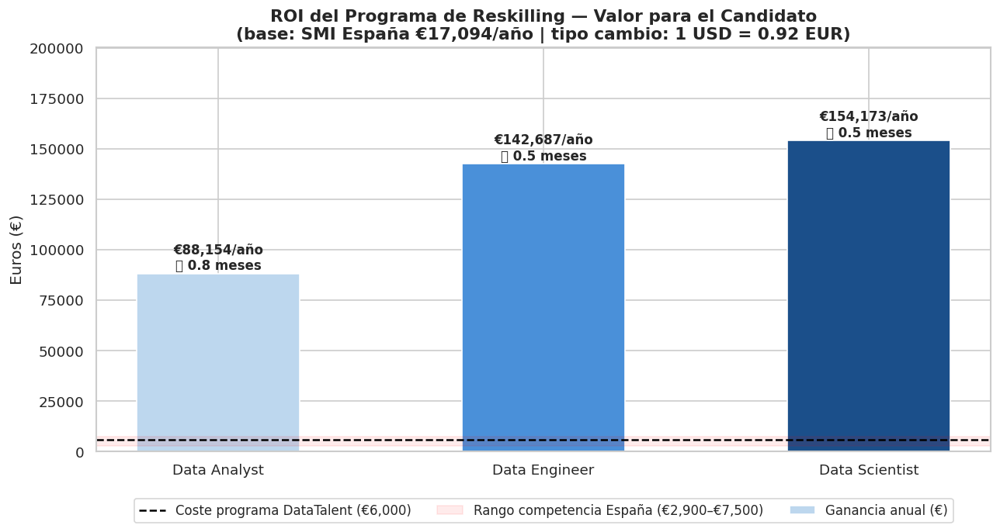
</p>

<p align="center">
  <em>Retorno económico estimado de un programa de reskilling en datos.</em>
</p>

**El reskilling se amortiza en menos de un año.** La progresión salarial proyectada para un perfil que completa el programa y accede al mercado como Data Analyst permite recuperar la inversión formativa en un periodo inferior a doce meses.

---

## Sesgos y Limitaciones

<details>
<summary>Ver los 8 sesgos identificados</summary>

<p align="center">
  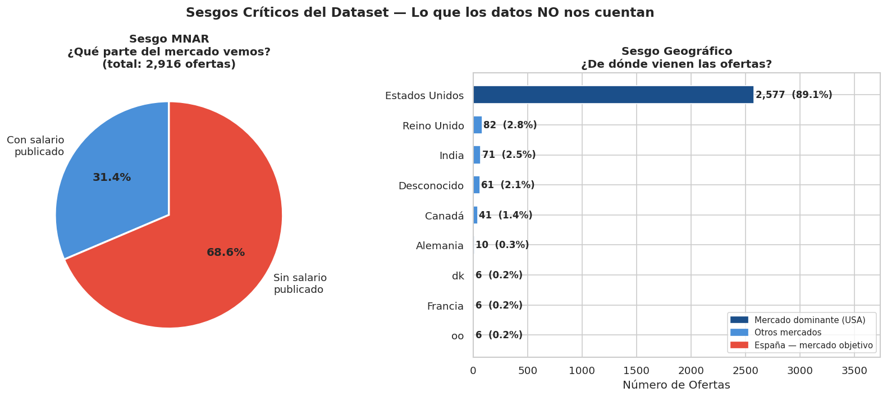
</p>

<p align="center">
  <em>Principales sesgos detectados en el dataset.</em>
</p>

### 1. Sesgo MNAR Salarial

* 68% de las ofertas no publican salario.
* Los salarios observados pueden estar sobreestimados.

### 2. Sesgo Geográfico

* 87% de las ofertas proceden de Estados Unidos.
* Los salarios no son directamente extrapolables a España.

### 3. Sesgo de Selección

* Predominio de grandes empresas con marca empleadora.

### 4. Ausencia de Variables Demográficas

* No es posible analizar diferencias por género.

### 5. Sesgo Temporal

* Datos concentrados en 2024.

### 6. Agregación de Skills

* Las categorías pueden ocultar tecnologías específicas.

### 7. Sesgo de Supervivencia

* No existen datos fiables de cierre de ofertas.

### 8. Solicitudes Subestimadas

* Solo una parte de las vacantes muestra aplicaciones reales.

### Conclusión

Los sesgos no invalidan el análisis. Su identificación permite interpretar correctamente los resultados y evitar decisiones erróneas.

</details>

---

## Recomendaciones Estratégicas

<details>
<summary>1. Priorizar Data Analyst como puerta de entrada</summary>

Los resultados muestran que Data Analyst es el rol con mayor accesibilidad para perfiles junior, ofreciendo una combinación equilibrada entre oportunidades de contratación y potencial salarial.

**Acción propuesta:** Diseñar el itinerario inicial del programa orientado a Data Analyst, maximizando la empleabilidad de los alumnos durante sus primeros meses de búsqueda laboral.

**Beneficio esperado:** Mayor tasa de inserción laboral y reducción del tiempo necesario para acceder al primer empleo en el sector de datos.

</details>

<details>
<summary>2. Diseñar itinerarios progresivos hacia Data Engineer y Data Scientist</summary>

Aunque Data Analyst representa la mejor puerta de entrada, los roles de Data Engineer y Data Scientist presentan salarios superiores y mayores oportunidades de especialización.

**Acción propuesta:** Crear rutas formativas escalonadas:

Data Analyst → Data Engineer → Data Scientist

permitiendo que los alumnos continúen desarrollando sus competencias una vez obtengan experiencia profesional.

**Beneficio esperado:** Mayor crecimiento salarial a medio plazo y mejora de la retención de alumnos mediante formación continua.

</details>

<details>
<summary>3. Construir el currículo sobre Cloud, Python y buenas prácticas de desarrollo</summary>

La validación realizada con fuentes españolas confirma que Cloud Computing, Python, Azure, AWS y Git se encuentran entre las habilidades más demandadas por las empresas.

**Acción propuesta:** Actualizar el contenido formativo priorizando:

* Python
* Git y control de versiones
* Cloud Computing
* Azure
* AWS
* Docker
* Buenas prácticas de desarrollo

**Beneficio esperado:** Mayor alineación entre la formación impartida y las necesidades reales del mercado laboral.

</details>

<details>
<summary>4. Incorporar módulos de negocio y comunicación</summary>

Las organizaciones no buscan únicamente perfiles técnicos. Los profesionales de datos deben ser capaces de comunicar resultados, interpretar necesidades de negocio y apoyar la toma de decisiones.

**Acción propuesta:** Incluir formación en:

* Storytelling con datos
* Presentaciones ejecutivas
* Comunicación de insights
* Pensamiento analítico orientado al negocio

**Beneficio esperado:** Profesionales más completos y con mayor capacidad para generar impacto dentro de las organizaciones.

</details>

<details>
<summary>5. Crear especializaciones sectoriales</summary>

El análisis muestra oportunidades relevantes en sectores como Healthcare, Finance, Manufacturing y Defense, además del sector tecnológico.

**Acción propuesta:** Desarrollar módulos optativos o itinerarios especializados por industria.

Ejemplos:

* Data Analytics para Healthcare
* Data Analytics para Finanzas
* Business Intelligence Industrial

**Beneficio esperado:** Diferenciación competitiva frente a otros programas formativos y mejor adaptación a distintos perfiles de alumnos.

</details>

<details>
<summary>6. Utilizar métricas de competitividad basadas en visualizaciones</summary>

La correlación observada entre visualizaciones y solicitudes permite utilizar las visualizaciones como indicador indirecto de competencia cuando no existen datos completos de aplicaciones.

**Acción propuesta:** Incorporar indicadores de competitividad en futuros análisis y herramientas de orientación laboral.

**Beneficio esperado:** Mejor comprensión del nivel de competencia existente en cada tipo de oferta y apoyo más efectivo a los candidatos durante su búsqueda de empleo.

</details>

<details>
<summary>7. Complementar el análisis con fuentes específicas del mercado español</summary>

El dataset principal presenta un fuerte sesgo geográfico hacia Estados Unidos. Aunque se realizó una validación complementaria, futuras decisiones deberían apoyarse en más fuentes locales.

**Acción propuesta:** Integrar periódicamente información procedente de:

* InfoJobs
* Tecnoempleo
* TicJob
* Fundación Telefónica
* Observatorios de empleo tecnológico

**Beneficio esperado:** Mayor precisión en la identificación de tendencias y una mejor adaptación de los programas a la realidad del mercado español.

</details>

---

## Instalación

Todos los resultados, gráficos y conclusiones presentados en este proyecto pueden regenerarse a partir de los datos y el código incluidos en este repositorio.

> ⚠️ **Dataset requerido** — Los notebooks necesitan el dataset de LinkedIn Job Postings. No está incluido en este repositorio por restricciones de tamaño. Descárgalo antes de ejecutar cualquier notebook.
>
> **Opción 1 — Descarga directa desde Kaggle:**
> [linkedin-job-postings en Kaggle](https://www.kaggle.com/datasets/arshkon/linkedin-job-postings)
>
> **Opción 2 — Descarga por código con `kagglehub`:**
> ```python
> import kagglehub
>
> # Download latest version
> path = kagglehub.dataset_download("arshkon/linkedin-job-postings")
>
> print("Path to dataset files:", path)
> ```

<details>
<summary>Ver instrucciones de instalación y ejecución</summary>

### Notebooks

| Fase | Archivo |
|------|---------|
| Phase 1 — Exploración inicial | `notebooks/Phase1_Initial_Exploration.ipynb` |
| Phase 2 — Limpieza y transformación | `notebooks/Phase2_Data_Cleaning_Preparation.ipynb` |
| Phase 3 — Análisis exploratorio (EDA) | `notebooks/Phase3_Statistical_Bias_Analysis.ipynb` |
| Phase 3.1 — Evaluación de sesgos | `notebooks/Phase3_1_Bias_Report.ipynb` |
| Phase 4 — Visualizaciones | `notebooks/Phase4_Visualization.ipynb` |

### Requisitos

- Python 3.12+
- Git
- Jupyter, VsCode o Google Colab (Notebook)

### Clonar el repositorio

```bash
git clone https://github.com/MajoRodri/HRIA.git
cd HRIA
```

### Crear un entorno virtual

**Windows**

```bash
python -m venv venv
venv\Scripts\activate
```

**Linux / macOS**

```bash
python -m venv venv
source venv/bin/activate
```

### Instalar dependencias

```bash
pip install -r requirements.txt
```

### Ejecutar los notebooks

```bash
jupyter notebook
```

o

```bash
jupyter lab
```

### Consideraciones

- Algunos resultados dependen de fuentes externas que pueden actualizarse con el tiempo.
- Los análisis reproducen el estado de los datos utilizados durante el desarrollo del proyecto.
- Las conclusiones deben interpretarse teniendo en cuenta los sesgos y limitaciones documentados en este informe.

</details>

---

## Equipo

Este proyecto ha sido desarrollado de forma colaborativa siguiendo una metodología ágil, combinando análisis de datos, visualización, investigación de mercado y validación de resultados.

| Miembro | Rol |
|----------|----------|
| [MajoRodri](https://github.com/MajoRodri) | Data Analyst & Developer |
| [MariaIsaDurango](https://github.com/MariaIsaDurango) | Data Analyst & Developer |
| [SiR0N](https://github.com/SiR0N) | Data Analyst & Developer |
| [JCRbit](https://github.com/JCRbit) | Scrum Master & Developer |
| [adryeli](https://github.com/adryeli) | Product Owner & Developer |

---

## Licencia

Proyecto desarrollado con fines educativos y académicos.

Los datasets utilizados mantienen las condiciones de uso establecidas por sus respectivos propietarios.

**HRIA — HR Intelligence & Bias Analysis**

Análisis basado en evidencia para programas de reskilling y orientación profesional en el mercado de datos.
