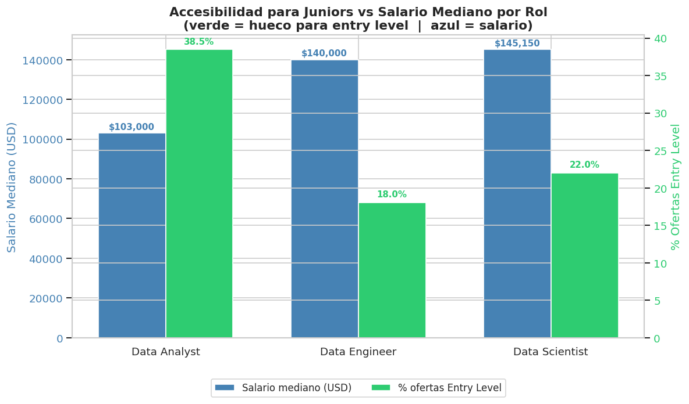
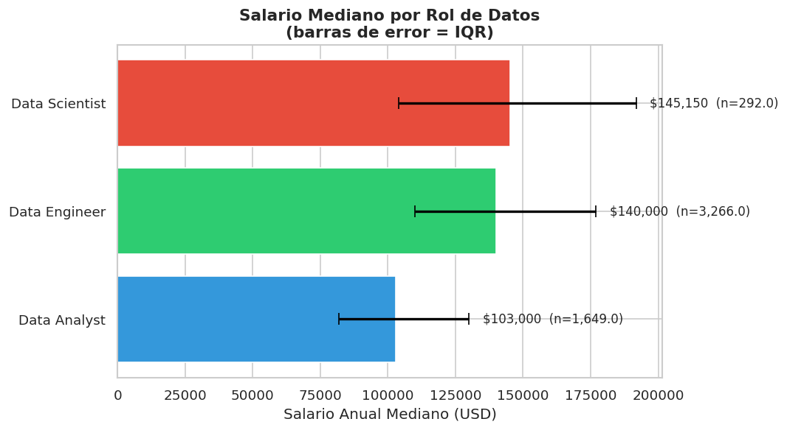
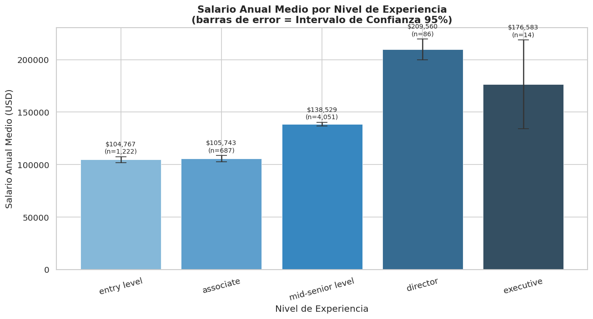
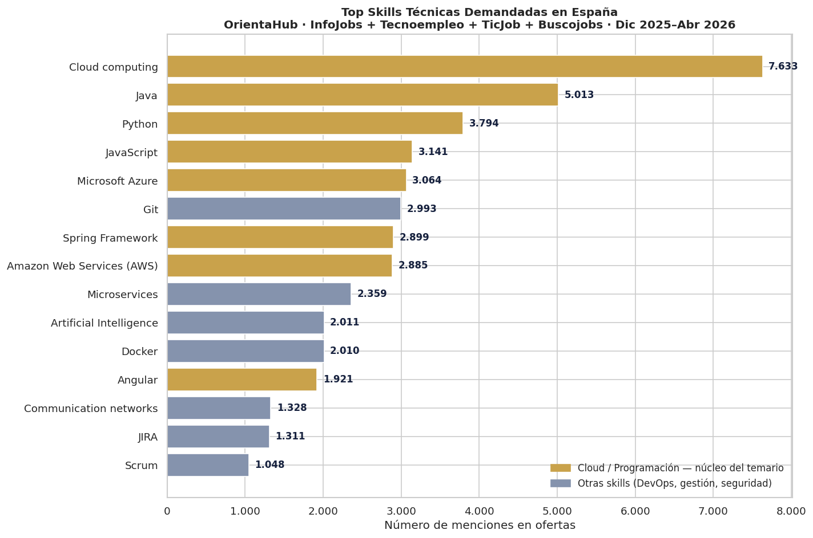
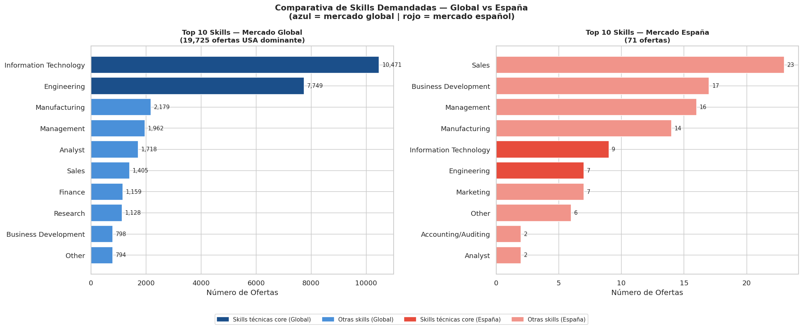
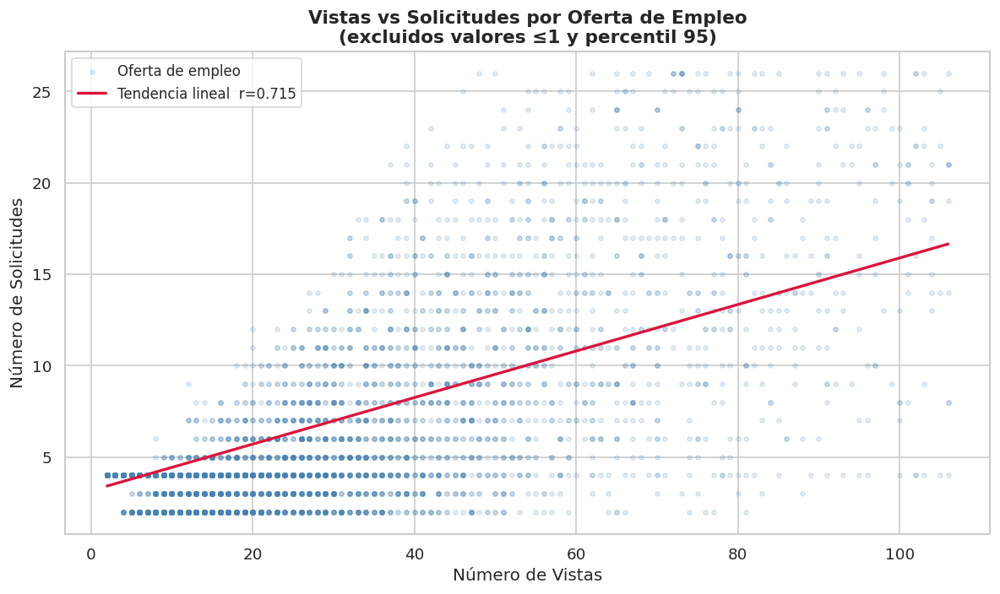
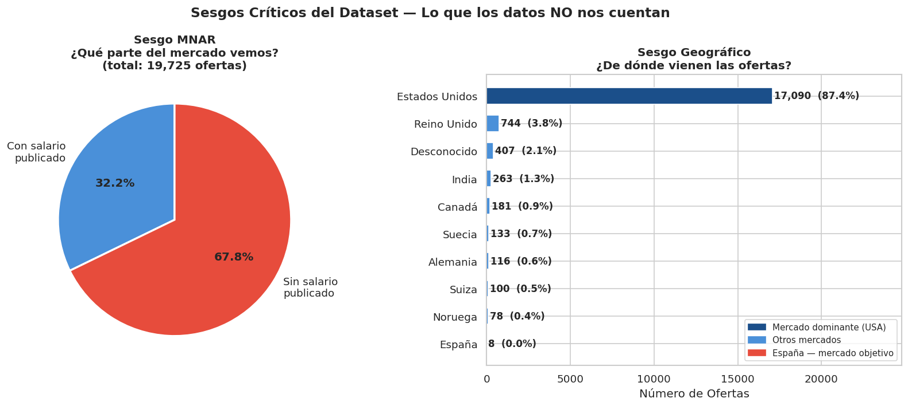

<p align="center">
  
</p>

# HRIA — HR Intelligence & Bias Analysis

## Índice

- Resumen Ejecutivo
- Problema de Negocio
- Dataset Utilizado
- Metodología
- Hallazgos Clave
- Sesgos y Limitaciones
- Recomendaciones
- Reproducibilidad
- Equipo

## Resumen Ejecutivo

HRIA (HR Intelligence & Bias Analysis) es un proyecto de análisis exploratorio de datos (EDA) desarrollado para DataTalent Solutions con el objetivo de diseñar programas de reskilling basados en evidencia y orientar a candidatos hacia las oportunidades más reales del mercado laboral de datos.

A partir del análisis de **19.725 ofertas de empleo** y fuentes complementarias del mercado español, identificamos qué perfiles ofrecen una mayor probabilidad de inserción laboral, qué habilidades son más demandadas, qué sectores generan más oportunidades y cuál es el retorno económico potencial de una transición profesional hacia los roles de datos.

### Hallazgos principales

* El **66% de las ofertas** corresponden a perfiles Mid-Senior.
* **Data Analyst** es la puerta de entrada más accesible para perfiles junior.
* El salto salarial de **Entry Level a Mid-Senior supera el 35%**.
* El mercado español prioriza habilidades como **Cloud Computing, Java, Python, Azure, Git y AWS**.
* El retorno económico estimado permite amortizar un programa de reskilling en menos de un año.

---

# Problema de Negocio

DataTalent Solutions necesitaba responder una pregunta estratégica:

> ¿Cómo diseñar un programa de reskilling alineado con la demanda real del mercado laboral y maximizar las oportunidades de colocación de sus alumnos?

Para ello era necesario comprender:

* Qué roles presentan mayor accesibilidad para nuevos profesionales.
* Qué habilidades técnicas demanda el mercado.
* Qué sectores concentran las oportunidades laborales.
* Qué retorno económico puede esperar un alumno.
* Qué limitaciones presentan los datos utilizados para tomar decisiones.

---

# Dataset Utilizado

### Dataset principal

* LinkedIn Job Postings Dataset (Kaggle)
* 19.725 ofertas analizadas
* Roles relacionados con datos y tecnología
* Información sobre:

  * Salarios
  * Seniority
  * Industrias
  * Skills
  * Aplicaciones y visualizaciones

### Fuentes complementarias

Para validar los resultados en el contexto español se incorporaron:

* Fundación Telefónica / OrientaHub (Infojobs, Tecnoempleo,etc)

Periodo analizado:

* LinkedIn Jobs 2024
* Mercado español: diciembre 2025 – abril 2026

---

# Metodología

El proyecto siguió un flujo completo de análisis exploratorio de datos (EDA).

## 1. Exploración

* Inspección de variables
* Identificación de tipos de datos
* Análisis descriptivo
* Evaluación de valores nulos

## 2. Limpieza

* Tratamiento de registros incompletos
* Normalización de categorías
* Validación de consistencia
* Revisión de outliers

## 3. Análisis

* Estadística descriptiva
* Comparaciones entre grupos
* Análisis salarial
* Análisis de skills
* Segmentación por industria
* Evaluación de competitividad

## 4. Sesgos

* Identificación de sesgos de selección
* Evaluación de datos faltantes
* Limitaciones geográficas
* Riesgos para la toma de decisiones

---

# Hallazgos Clave

## ¿Qué rol priorizar?

<!-- FASE 4 - VISUALIZACIÓN 10 -->
<!-- Accesibilidad Junior vs Salario -->

<p align="center">
  
</p>

<p align="center">
  <em>Figura 1. Accesibilidad de los principales roles de datos para perfiles junior.</em>
</p>

### Data Analyst es la mejor puerta de entrada

El 38,5% de las ofertas para Data Analyst son accesibles para perfiles junior, frente al 22% para Data Scientist y el 18% para Data Engineer.

### Implicación

La primera colocación es significativamente más probable comenzando por Data Analyst.

### Recomendación

Diseñar programas de entrada orientados a Data Analyst y utilizarlo como primer escalón profesional.

---

## ¿Qué salario esperar?

<!-- FASE 4 - VISUALIZACIÓN 9 -->
<!-- Salario mediano por rol -->

<p align="center">
  
</p>

<p align="center">
  <em>Figura 2. Comparativa salarial entre Data Analyst, Data Engineer y Data Scientist.</em>
</p>

<p align="center">
  
</p>

<p align="center">
  <em>Figura 2.1 Progresión salarial según experiencia.</em>
</p>


### El mayor salto salarial ocurre entre Entry y Mid-Senior

El incremento salarial estimado supera los 35.000 dólares anuales.

### Implicación

El valor económico del reskilling aparece principalmente al alcanzar niveles Mid-Senior.

### Recomendación

Comunicar el retorno económico del programa utilizando este tramo de progresión profesional.

---

## ¿Qué skills enseñar?

<!-- VALIDACIÓN MERCADO ESPAÑOL -->

<p align="center">
  
</p>

<p align="center">
  <em>Figura 3. Top skills técnicas demandadas en España.</em>
</p>

### El mercado español prioriza habilidades concretas

Top tecnologías identificadas:

1. Cloud Computing
2. Java
3. Python
4. JavaScript
5. Microsoft Azure
6. Git
7. AWS
8. Microservices
9. Docker
10. Artificial Intelligence

### Implicación

Las empresas demandan perfiles capaces de combinar programación, cloud y buenas prácticas de desarrollo.

### Recomendación

Construir el currículo sobre:

* Cloud
* Python
* Git
* Azure / AWS
* Metodologías ágiles
* Comunicación de datos

---

## ¿Qué industrias contratar?

<p align="center">
  
</p>

<p align="center">
  <em>Figura 4. Distribución de oportunidades por industria.</em>
</p>

Aunque IT Services lidera el volumen de contratación, existen oportunidades relevantes en:

* Healthcare
* Finance
* Manufacturing
* Defense

### Implicación

La especialización sectorial puede convertirse en una ventaja competitiva.

### Recomendación

Crear itinerarios específicos por industria.

---

## Competencia del Mercado

<p align="center">
  
</p>

<p align="center">
  <em>Figura 5. Relación entre visualizaciones y solicitudes en ofertas de empleo de datos.</em>
</p>
Solo el 39% de las ofertas muestran solicitudes reales.

Sin embargo, la correlación entre vistas y solicitudes alcanza:

**r = 0,72**

### Implicación

Las vistas pueden utilizarse como indicador universal de competitividad.

### Recomendación

Desarrollar servicios de inteligencia laboral basados en la dificultad estimada de cada oferta.

---

# Sesgos y Limitaciones

El análisis identifica ocho sesgos principales.

<!-- FASE 4 - VISTAS VS SOLICITUDES -->

<!-- INTRODUCCIÓN SESGOS -->

<p align="center">
  
</p>

<p align="center">
  <em>Figura 6. Principales sesgos detectados en el dataset.</em>
</p>

## 1. Sesgo MNAR Salarial

* 68% de las ofertas no publican salario.
* Los salarios observados pueden estar sobreestimados.

## 2. Sesgo Geográfico

* 87% de las ofertas proceden de Estados Unidos.
* Los salarios no son directamente extrapolables a España.

## 3. Sesgo de Selección

* Predominio de grandes empresas con marca empleadora.

## 4. Ausencia de Variables Demográficas

* No es posible analizar diferencias por género.

## 5. Sesgo Temporal

* Datos concentrados en 2024.

## 6. Agregación de Skills

* Las categorías pueden ocultar tecnologías específicas.

## 7. Sesgo de Supervivencia

* No existen datos fiables de cierre de ofertas.

## 8. Solicitudes Subestimadas

* Solo una parte de las vacantes muestra aplicaciones reales.

### Conclusión

Los sesgos no invalidan el análisis.

Su identificación permite interpretar correctamente los resultados y evitar decisiones erróneas.

---

# Recomendaciones Estratégicas

## 1. Priorizar Data Analyst como puerta de entrada

Los resultados muestran que Data Analyst es el rol con mayor accesibilidad para perfiles junior, ofreciendo una combinación equilibrada entre oportunidades de contratación y potencial salarial.

### Acción propuesta

Diseñar el itinerario inicial del programa orientado a Data Analyst, maximizando la empleabilidad de los alumnos durante sus primeros meses de búsqueda laboral.

### Beneficio esperado

Mayor tasa de inserción laboral y reducción del tiempo necesario para acceder al primer empleo en el sector de datos.

---

## 2. Diseñar itinerarios progresivos hacia Data Engineer y Data Scientist

Aunque Data Analyst representa la mejor puerta de entrada, los roles de Data Engineer y Data Scientist presentan salarios superiores y mayores oportunidades de especialización.

### Acción propuesta

Crear rutas formativas escalonadas:

Data Analyst → Data Engineer → Data Scientist

permitiendo que los alumnos continúen desarrollando sus competencias una vez obtengan experiencia profesional.

### Beneficio esperado

Mayor crecimiento salarial a medio plazo y mejora de la retención de alumnos mediante formación continua.

---

## 3. Construir el currículo sobre Cloud, Python y tecnologías cloud

La validación realizada con fuentes españolas confirma que Cloud Computing, Python, Azure, AWS y Git se encuentran entre las habilidades más demandadas por las empresas.

### Acción propuesta

Actualizar el contenido formativo priorizando:

* Python
* Git y control de versiones
* Cloud Computing
* Azure
* AWS
* Docker
* Buenas prácticas de desarrollo

### Beneficio esperado

Mayor alineación entre la formación impartida y las necesidades reales del mercado laboral.

---

## 4. Incorporar módulos de negocio y comunicación

Las organizaciones no buscan únicamente perfiles técnicos. Los profesionales de datos deben ser capaces de comunicar resultados, interpretar necesidades de negocio y apoyar la toma de decisiones.

### Acción propuesta

Incluir formación en:

* Storytelling con datos
* Presentaciones ejecutivas
* Comunicación de insights
* Pensamiento analítico orientado al negocio

### Beneficio esperado

Profesionales más completos y con mayor capacidad para generar impacto dentro de las organizaciones.

---

## 5. Crear especializaciones sectoriales

El análisis muestra oportunidades relevantes en sectores como Healthcare, Finance, Manufacturing y Defense, además del sector tecnológico.

### Acción propuesta

Desarrollar módulos optativos o itinerarios especializados por industria.

Ejemplos:

* Data Analytics para Healthcare
* Data Analytics para Finanzas
* Business Intelligence Industrial

### Beneficio esperado

Diferenciación competitiva frente a otros programas formativos y mejor adaptación a distintos perfiles de alumnos.

---

## 6. Utilizar métricas de competitividad basadas en visualizaciones

La correlación observada entre visualizaciones y solicitudes permite utilizar las visualizaciones como indicador indirecto de competencia cuando no existen datos completos de aplicaciones.

### Acción propuesta

Incorporar indicadores de competitividad en futuros análisis y herramientas de orientación laboral.

### Beneficio esperado

Mejor comprensión del nivel de competencia existente en cada tipo de oferta y apoyo más efectivo a los candidatos durante su búsqueda de empleo.

---

## 7. Complementar el análisis con fuentes específicas del mercado español

El dataset principal presenta un fuerte sesgo geográfico hacia Estados Unidos. Aunque se realizó una validación complementaria, futuras decisiones deberían apoyarse en más fuentes locales.

### Acción propuesta

Integrar periódicamente información procedente de:

* InfoJobs
* Tecnoempleo
* TicJob
* Fundación Telefónica
* Observatorios de empleo tecnológico

### Beneficio esperado

Mayor precisión en la identificación de tendencias y una mejor adaptación de los programas a la realidad del mercado español.
omplementar el análisis con fuentes específicas del mercado español.

---

# Equipo

Este proyecto ha sido desarrollado de forma colaborativa siguiendo una metodología ágil, combinando análisis de datos, visualización, investigación de mercado y validación de resultados.

| Miembro | Rol |


| Miembro | Rol |
|----------|----------|
| [MajoRodri](https://github.com/MajoRodri) | Data Analyst & Developer |
| [MariaIsaDurango](https://github.com/MariaIsaDurango) | Data Analyst & Developer |
| [SiR0N](https://github.com/SiR0N) | Data Analyst & Developer |
| [JCRbit](https://github.com/JCRbit) | Scrum Master & Developer |
| [adryeli](https://github.com/adryeli) | Product Owner & Developer |

## Principio de Reproducibilidad

Uno de los principios fundamentales de la ciencia de datos es la reproducibilidad.

Todos los resultados, gráficos y conclusiones presentados en este proyecto pueden regenerarse a partir de los datos y el código incluidos en este repositorio.


# Reproducibilidad

## Requisitos

- Python 3.12+
- Git
- Jupyter, VsCode o Google Colab (Notebook)


---

## Clonar el repositorio

```bash
git clone https://github.com/MajoRodri/HRIA.git
cd HRIA
```

---

## Crear un entorno virtual

### Windows

```bash
python -m venv venv
venv\Scripts\activate
```

### Linux / macOS

```bash
python -m venv venv
source venv/bin/activate
```

---

## Instalar dependencias

```bash
pip install -r requirements.txt
```

---

## Ejecutar los notebooks

Abrir Jupyter Notebook (o VsCode/Google Colab):

```bash
jupyter notebook
```

o

```bash
jupyter lab
```

Los notebooks contienen:

- Exploración inicial de datos (Phase 1)
- Limpieza y transformación (Phase 2)
- Análisis exploratorio (EDA) (Phase 3)
- Evaluación de sesgos (Phase 3.1)
- Visualizaciones (Phase 4)


## Consideraciones

- Algunos resultados dependen de fuentes externas que pueden actualizarse con el tiempo.
- Los análisis reproducen el estado de los datos utilizados durante el desarrollo del proyecto.
- Las conclusiones deben interpretarse teniendo en cuenta los sesgos y limitaciones documentados en este informe.

---

## Licencia

Proyecto desarrollado con fines educativos y académicos.

Los datasets utilizados mantienen las condiciones de uso establecidas por sus respectivos propietarios.

**HRIA — HR Intelligence & Bias Analysis**

Análisis basado en evidencia para programas de reskilling y orientación profesional en el mercado de datos.
